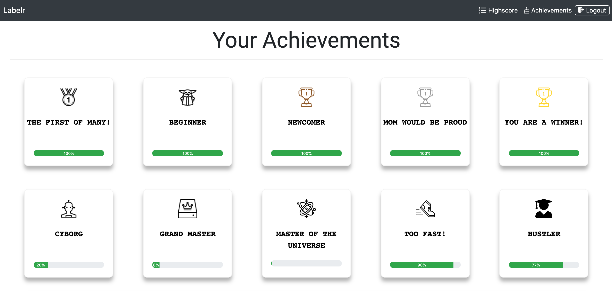

# Labelr

## Introduction
`Lablr` is a web application, which makes it possible to categorize large image data sets for machine learning models.
Customers can upload their data sets to the platform and have them labeled by the community.
It was developed as part of the course "Scalable Systems" at the Technical University of Berlin.

## Installation
1. Clone project
```
$ git clone https://github.com/loychris/image-labeler-app.git
```
2. Install dependencies and run backend
```
$ cd backend && npm install
$ npm start
```
3. Install dependencies and run frontend
```
$ cd frontend && npm install
$ npm start
```
4. Open localhost:<port>

For database interaction make sure MongoDB is running and configure a connection string in `/backend/src/db/mongoose.js`

## Development
This application was primarily developed with MERN stack.  

**Backend**
- Express
- Node
- MongoDB

**Frontend**
- React.js
- Bootstrap

## Demo
- lable images<br>
<br>
<hr>

- become on of the top labelers<br>
<br>
<hr>

- unlock achievments<br>
<br>

## Project Organization
**Backend**
- [@duanitamir]( https://github.com/duanitamir )
- [@m-31415926535]( https://github.com/m-31415926535 )
- [@antoniapriesnitz]( https://github.com/antoniapriesnitz)

**Frontend**
- [@loychris]( https://github.com/loychris )
- [@morixn]( https://github.com/morixn )
- [@mbnbln]( https://github.com/mbnbln )
- [@phofmn]( https://github.com/phofmn )

**DevOps**
- [@phofmn]( https://github.com/phofmn )

**Scrum Master**
- [@antoniapriesnitz]( https://github.com/antoniapriesnitz )

**Product Owner**
- [@loychris]( https://github.com/loychris )

**QA**
- [@morixn]( https://github.com/morixn )
